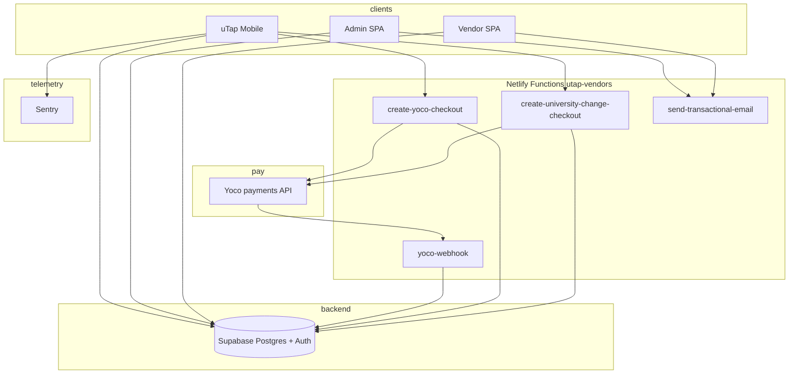

# Domain-Level Knowledge: uTap System Architecture

**Audience:** Product, engineering, and operations stakeholders who need a shared mental model of how the platform fits together.

**Scope:** This overview reflects the repositories commonly used together: **`utap-apps`**, **`utap-admin`**, **`utap-vendors`**, **`utapwebsiite`** (marketing site repository folder name), **`expo-mifare-scanner`**, and **`utap-docs`** (this handbook, `docs/system/market/`, and topic guides under `docs/`). It is descriptive, not a specification. **`utap-shared`** is referenced from tooling as a future shared workspace; it is not a runtime dependency until it contains published packages.

**Where to look:** [§9](#9-product-and-operations-initiatives-cross-repo) summarises **feature themes** across apps (good for standups). [§12](#12-recent-repo-history-indicative) summarises **`git log`** themes. Neither replaces code or merged **PR (Pull Request)** history.

---

## 1. What uTap Is

uTap is a **student-facing digital wallet** centred on **NFC (Near Field Communication)** student cards. Students can **scan** physical university cards, **store** card-related data, **sync** it to the cloud, and **use phone-based NFC** where supported (including emulation paths documented in-repo). Alongside that core, the mobile app ships **Ushop** (campus commerce) and **uGig** (a gigs / sports-store style marketplace slice using the same commerce plumbing). **Marketplace browsing and checkout are tied to the student’s profile university** (including campuses under that university), with a **paid university switch** path where policy and migrations require it.

The **React Native / Expo** app (`utap-apps`) is the operational hub: most user journeys and integrations live there.

---

## 2. Applications and Roles

| Surface | Stack (observed) | Primary role |
| --- | --- | --- |
| **uTap mobile** (`utap-apps`) | Expo / React Native, Supabase client, **Yoco** hosted checkout (in-app **WebView**), **Netlify Functions** (HTTP calls to vendor site), Sentry, custom NFC module | Student app: auth, cards, NFC, Ushop, uGig, orders, profile, university change fee |
| **Admin web** (`utap-admin`) | Vite, React, TypeScript, Supabase; **Netlify** hosting (see repo `netlify.toml` + deploy workflow) | Internal ops: universities, vendors, stores, products, analytics, **mobile feature policy** overrides |
| **Vendor portal** (`utap-vendors`) | Vite, React, Supabase; **Netlify** + **`netlify/functions`** | Vendor UX, payment return pages, **serverless**: Yoco checkout creation, webhooks, payouts, email, tickets |
| **Marketing site** (`utapwebsiite`) | Vite, React | Public marketing / landing content |
| **NFC module** (`expo-mifare-scanner`) | Expo native module (Android/iOS), **`@utapza/expo-mifare-scanner`** | MIFARE / NFC bridge consumed by **`utap-apps`** |
| **Documentation** (`utap-docs`) | Markdown | Fibery handbook (`docs/fibery/`), product copy **SSOT (single source of truth)** in `docs/system/market/`, deep dives under `docs/`; **`adr/`** at repo root for decisions (e.g. Yoco **WebView** checkout) |

---

## 3. Central Backend: Supabase

Across mobile and web apps, **Supabase** (PostgreSQL + Auth + client SDKs) is the shared backend for:

- **Authentication** (email/password; password reset flows integrate with transactional email—see mobile/admin commits and Netlify `send-transactional-email`).
- **Data access** via `@supabase/supabase-js` using project URL and anon (public) key from environment configuration.

The mobile app wires credentials through **`supabaseService.js`**. **RLS (Row Level Security)** and SQL (including **RPC (Remote Procedure Call)** such as `request_university_change`) enforce what clients may do; **Netlify Functions** use the **service role** key where server-side trust is required (checkout creation, **Yoco** webhook side effects, payouts).

**Feature policy:** Tabs and major areas can be gated from **build-time env** (behind `EXPO_PUBLIC_UTAP_FEATURE_BUILD_OVERRIDES=1`) plus **`profiles.feature_policy_overrides`** and **`universities.feature_policy_overrides`**. See [`../../development/feature-policy.md`](../../development/feature-policy.md) (canonical); **`utap-apps`** keeps a short pointer at `docs/development/feature-policy.md`. Use admin UI for university/student mobile policy.

---

## 4. Serverless: Netlify Functions (`utap-vendors`)

The **vendor portal** repo ships **Netlify Functions** (`netlify/functions/`, configured in `netlify.toml`). These are the **trusted server** entry points for **Yoco** and related automation. The mobile app calls them over HTTPS (default base `https://vendors.utaptech.co.za/.netlify/functions`, overridable via **`EXPO_PUBLIC_VENDOR_FUNCTIONS_BASE_URL`**).

| Function (file) | Role |
| --- | --- |
| **`create-yoco-checkout`** | Creates **Yoco** hosted checkout for an **order**; returns `redirectUrl` for **`YocoCheckoutWebView`**. Uses Yoco **API (Application Programming Interface)** and Supabase **service role** to read/write order rows safely. |
| **`create-university-change-checkout`** | Same pattern for **paid university change** (authenticated **Bearer** token + `universityChangeRequestId`). |
| **`yoco-webhook`** | **Webhook** verifier for **Yoco** events: updates order payment state, university-change rows, optional follow-ups (e.g. ticket generation, email hooks). Authoritative for “money landed” side effects. |
| **`create-monthly-payouts`** | Scheduled payout logic (Netlify **cron** in `export const config`). |
| **`generate-ticket`** | PDF / ticket generation invoked after paid flows (see webhook integration). |
| **`send-transactional-email`** | Server-side email via **Resend** (contact form, payment-related mail, etc.); **CORS (Cross-Origin Resource Sharing)** and bearer patterns mirror other functions. |

**Admin** (`utap-admin`) and **vendors** can also call **`send-transactional-email`** using the same Netlify base URL pattern (see `transactionalEmailService` / `emailApi` in respective repos). Operational detail: **`utap-vendors`** `docs/deployment/` and **`utap-admin`** `docs/deployment/netlify-github-actions.md`.

---

## 5. Payments: Yoco (primary student flow)

- **Checkout:** **`yocoPaymentService`** posts `{ orderId }` to **`create-yoco-checkout`**. **`universityChangePaymentService`** uses **`create-university-change-checkout`** after **`request_university_change`** RPC.
- **In-app UX:** **`YocoCheckoutWebView`** loads **Yoco**’s hosted page inside the app (do **not** rely on external browser alone for return URL classification—see **`yocoCheckoutUrls.js`**).
- **Settlement truth:** **`yoco-webhook`** updates Postgres so **RLS**-scoped clients see paid state only after server confirmation.

**Stripe:** **`stripePaymentService.js`** and **`@stripe/stripe-react-native`** still appear in the **`utap-apps`** tree historically; **active Ushop order checkout and the flows above use Yoco**, not that service. Treat Stripe as **legacy / unused** unless you explicitly revive it.

Further product and money-flow narrative: [`../../strategy/monetization-and-marketplace-scope.md`](../../strategy/monetization-and-marketplace-scope.md). Architecture decision records: [`../../adr/README.md`](../../adr/README.md).

---

## 6. Mobile App Architecture (`utap-apps`)

### 6.1 Entry and global wiring

- **`App.js`**: `SafeAreaProvider` → `PaperProvider` → `NavigationContainer` → **`AuthProvider`** → **`FeaturePolicyProvider`** → **`CardProvider`** (see `CLAUDE.md` in that repo).
- State is **React Context**–centric (no Redux / Zustand).

### 6.2 Navigation

Bottom tabs (**Cards**, **Ushop**, **uGig**, **Profile**, **Orders**) when authenticated; tab visibility follows **feature policy**. Auth stack for guests.

### 6.3 Services layer (illustrative)

| Area | Role |
| --- | --- |
| **supabaseService** | Auth, profiles, cards, RPC |
| **yocoPaymentService** | Order checkout session via Netlify **`create-yoco-checkout`** |
| **universityChangePaymentService** | Paid switch via RPC + **`create-university-change-checkout`** |
| **transactionalEmailService** | Calls **`send-transactional-email`** on Netlify where used |
| **nfcService** / **cardScanService** / **storageService** | NFC pipeline + **SecureStore** |
| **ushopService** / **orderService** | Catalogue and orders against Supabase |

### 6.4 Builds

**EAS (Expo Application Services)** for binaries; **Sentry** for crash telemetry. NFC module version follows **`utap-apps`** `package.json` (tracks **`expo-mifare-scanner`** releases).

---

## 7. NFC / Card Pipeline (Conceptual)

See [`../../nfc-and-module/CARD_SCANNING_AND_EMULATION.md`](../../nfc-and-module/CARD_SCANNING_AND_EMULATION.md): logical card JSON vs raw MIFARE payload; **CardContext** + Supabase sync. Risks: [`../risk-and-compliance/pitfalls-and-risks.md`](../risk-and-compliance/pitfalls-and-risks.md).

---

## 8. Ushop, uGig, and Orders

Same commerce model and **`ushopService`**; **uGig** is a filtered slice. **Orders** use **`orderService`** plus **Yoco** checkout and webhook-driven payment status. **Promo / subtotal** UX and **order window / cutoff** behaviour sit in the same commerce layer—see **§9** and **`git log`** on **`utap-apps`** / **`utap-vendors`**.

---

## 9. Product and operations initiatives (cross-repo)

This section records **what the platform is building toward** across vendors, mobile, admin, and docs—useful when **Fibery** or onboarding docs lag a single repo. It reflects **coordinated engineering themes** (including work surfaced from **Cursor** agent sessions in mid‑May 2026); **confirm** each bullet against current code and **`git log`** before treating it as shipped scope.

| Theme | What it covers | Repos / artifacts |
| --- | --- | --- |
| **Vendor store availability and order cutoff** | **Recurring hours**, **IANA (Internet Assigned Numbers Authority)** time zones, **exceptions**, **operational modes** (open / closed / soft “closing soon” / hard pause), **server-side last order time** with buffers, and **checkout protection** when the kitchen window has passed. **Vendor dashboard** editors for hours/cutoff; **student app** surfacing on **store cards** and **blocking or warning** checkout after cutoff. | **`utap-vendors`**, **`utap-apps`**, Supabase migrations |
| **Transactional email and Supabase Auth** | **Resend** mail from **`send-transactional-email`** **Netlify Function**; vendor landing **contact**; payment-adjacent mail from **`yoco-webhook`** paths where implemented. **Forgot / reset password** on admin and mobile aligned with **Supabase Auth** redirect and **HTTPS** bases for **`utaptech.co.za`**. Hardening checklist: [`../../security/TRANSACTIONAL_EMAIL_INGRESS_TODO.md`](../../security/TRANSACTIONAL_EMAIL_INGRESS_TODO.md). SMTP / redirect reference: [`../../deployment/SUPABASE_SMTP_AND_AUTH_REDIRECTS.md`](../../deployment/SUPABASE_SMTP_AND_AUTH_REDIRECTS.md). | **`utap-vendors`**, **`utap-apps`**, **`utap-admin`**, **`utap-docs`** |
| **Discounts and promotions (student commerce)** | **UI/UX (User Interface / User Experience)** for browse-time **promo** signals and clearer **order breakdown** (subtotal, savings, amount paid) on promo orders—paired with **Postgres** pricing / offer fields. | **`utap-apps`**, migrations |
| **Schema and build stability** | Align **RPC** and app code with live **Postgres** (e.g. **`order_items`** / **`price`**, **`create_order_with_items`**) so **Android/iOS** and web builds do not drift from production schema. | **`utap-apps`**, **`utap-admin`**, **`utap-vendors`** |
| **Admin and vendor CI/CD** | **GitHub Actions** workflows deploying **`utap-admin`** (and vendor patterns) to **Netlify**; document **repository vs organisation** secrets when using **`gh` (GitHub CLI)**. | **`utap-admin`** `docs/deployment/netlify-github-actions.md`, **`utap-vendors`** `docs/deployment/` |
| **Vendor dashboard product planning** | Roadmap and **UX (User Experience)** plans for **vendor profile** management and **repeat customer** management—see e.g. [`../../plans/2026-05-12-vendor-admin-dashboard-ux-visualization-plan.md`](../../plans/2026-05-12-vendor-admin-dashboard-ux-visualization-plan.md). | **`utap-docs`** `docs/plans/`, **`utap-vendors`** |
| **Repo hygiene** | **`.DS_Store`** untracked, **`.gitignore`** tightened, **logical commits** per feature (avoid one giant diff). | all repos |

**Secrets:** Do not commit **API keys** (payments, **Resend**, stock imagery providers, etc.). Store them in **Netlify** / **EAS** env configuration; **rotate** any key that may have appeared in chat or a pasted doc.

---

## 10. Web vs Mobile vs Serverless

- **SPAs (Single Page Applications)** on admin and vendor sites talk **directly to Supabase** with anon keys for normal CRUD where **RLS** allows.
- **Money movement and cron-style jobs** go through **Netlify Functions** on **`utap-vendors`** (service role, **Yoco** secrets, **Resend** API key)—not through a long-lived custom API container in these repos.

---

## 11. Key Technical Decisions (Observed)

1. **Supabase** as single **BaaS (Backend as a Service)** for auth + data + **RLS**.
2. **Yoco + Netlify Functions** for South Africa–friendly card checkout with a **small server surface** next to the vendor deploy.
3. **In-app WebView** for **Yoco** return URL control (ADR-0001).
4. **Custom Expo NFC module** for MIFARE-level behaviour.
5. **Context** state + **feature policy** layering for pilots.
6. **Dual storage**: **SecureStore** + cloud sync for cards.

---

## 12. Recent repo history (indicative)

Themes from **`git log`** (newest-first batches; not exhaustive). Overlaps **§9**—use both when writing a team update.

| Repository | Examples of what landed recently |
| --- | --- |
| **`utap-apps`** | Profile university scoped marketplace; **paid university change** + **Yoco** **WebView**; **feature policy** env gates (`BUILD_OVERRIDES`, `DISABLED` list); orders / promo display; auth password recovery deep links; **`reason_code`** forwarding from checkout API. |
| **`utap-vendors`** | **`create-university-change-checkout`** + **`yoco-webhook`** extensions; **`send-transactional-email`** + **Resend**; **`create-monthly-payouts`** / webhook hardening; store **hours** and **order cutoff** editors; landing **contact** → email; Netlify **CI (Continuous Integration)** docs for deploy. |
| **`utap-admin`** | University + student **feature policy** UI; forgot/reset password; dashboard **analytics** from Supabase; **Netlify** deploy workflow; **orders** **RLS** and **`create_order_with_items`** alignment. |
| **`expo-mifare-scanner`** | **2.0.11** (and prior patch releases); iOS availability / emulation messaging; Sentry removed from native scanner module. |
| **`utapwebsiite`** | Early marketing scaffold (`first commit` only in sample log—treat as low churn unless you see newer commits). |
| **`utap-docs`** | This tree may live **without** a `.git` directory in some local clones—version history then depends on how you mirror or publish docs. |

---

## 13. Diagram (Logical)

---

## 14. Document Maintenance

Update this file when payment, webhook, **Netlify**, or **§9** initiative areas change; keep [`../risk-and-compliance/pitfalls-and-risks.md`](../risk-and-compliance/pitfalls-and-risks.md) aligned. Refresh **§9** after planning sessions; refresh **§12** after major releases (`git log` per repo). Product copy lives under **`utap-docs`** `docs/system/market/` per [`../../README.md`](../../README.md).
